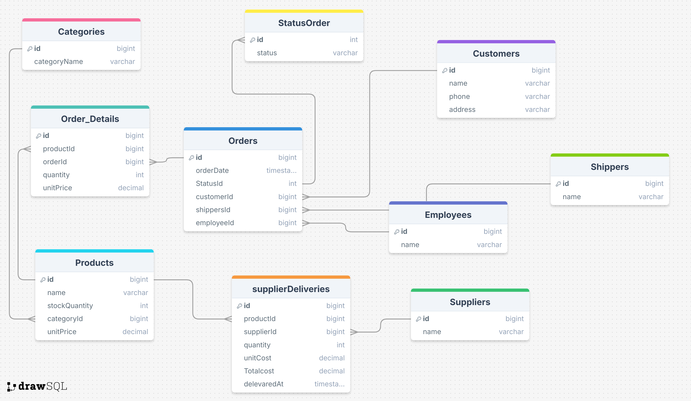

# Sales System (ERD)

##  Project Overview
This repository contains the Entity Relationship Diagram (ERD) for a Sales Management System.

The goal of this project is to design a structured and normalized database schema that could support a full sales workflow including customers, orders, products, suppliers, and shipments.

This is a database design project (not implemented yet as a physical database).

---

##  Main Entities

- Customers
- Orders
- Order_Details
- Products
- Categories
- Suppliers
- SupplierDeliveries
- Shippers
- Employees
- OrderStatus

---

##  Key Relationships

- One Customer can have many Orders.
- One Order can contain multiple Order_Details.
- One Product can appear in many Order_Details.
- One Category can contain multiple Products.
- One Supplier can deliver multiple Products.
- One Product can have multiple SupplierDeliveries.
- Each Order has one Status.
- Each Order is handled by one Employee.
- Each Order is shipped by one Shipper.

---

##  Design Principles

- The schema follows normalization principles.
- Many-to-many relationships are resolved using junction tables (Order_Details).
- Foreign keys are used to maintain referential integrity.
- Status values are separated into a dedicated table for scalability.

---

##  ERD Diagram

---

##  Possible Future Implementation

This schema can be implemented using:

- PostgreSQL
- MySQL
- SQL Server

It could also serve as the backend database for a full-stack web application.

---

